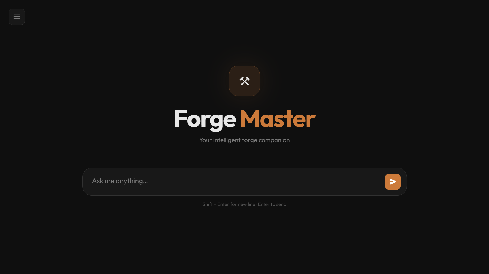

# Forge Master

A futuristic Retrieval Augmented Generation (RAG) workspace with a polished web experience, built using FastAPI, Ollama, and FAISS. Ask questions, upload documents, and shape responses with session memory, system prompt overrides, and mode selection.


## 🎬 Demo

### Platform Interface — Opening View
The intuitive futuristic interface with Forge Master branding. Start chatting immediately with a clean, responsive layout.



### How It Works — In Action
Watch how the RAG platform retrieves documents and streams intelligent responses in real time.

[](NEW.mp4)

**[📹 Click here to watch the demo video](https://github.com/SiddharthMaverick/llm-platform/raw/main/NEW.mp4)** — See real-time RAG retrieval and streaming responses in action.

## �🎯 Features

- **📚 RAG-powered knowledge**: Retrieve context-aware answers from your uploaded documents using FAISS vector search and semantic embeddings
- **🧠 Session memory**: Maintain conversation context across multiple turns; clear memory anytime to start fresh
- **⚙️ Mode selection**: Choose from Chat, Summarize, Explain, Code Review, or Answer modes to tailor responses
- **📝 Custom system prompt**: Override assistant behavior for fine-grained control over response generation
- **🚀 Streaming replies**: See the model generate responses in real time, token by token
- **📤 Document upload**: Add PDFs or plain text files on the fly to expand your knowledge base
- **🔐 Local inference**: Run Ollama locally with no external API keys or cloud dependencies
- **🎨 Futuristic UI**: Modern Forge Master-branded interface with responsive design for desktop and mobile
- **⚡ Fast embeddings**: 384-dimensional semantic vectors using SentenceTransformer for accurate retrieval

## 📋 Prerequisites

- **Python 3.9+**
- **Ollama** installed and available on your PATH
- **Git** (optional, for cloning the repo)
- **8GB+ RAM** (16GB+ recommended for model performance)

## 🚀 Quick Start

### 1. Clone and Navigate
```bash
git clone https://github.com/SiddharthMaverick/llm-platform.git
cd llm-platform
```

### 2. Create Virtual Environment
**On Windows:**
```bash
python -m venv venv
venv\Scripts\activate
```

**On macOS/Linux:**
```bash
python3 -m venv venv
source venv/bin/activate
```

### 3. Install Dependencies
```bash
pip install -r requirements.txt
```

### 4. Start Ollama Server
Open a new terminal and start Ollama (must be installed and on PATH):
```bash
ollama serve
```

### 5. Pull the Model
```bash
ollama pull phi3
```

### 6. Launch the Application
```bash
uvicorn app.main:app --reload
```

### 7. Open in Browser
Navigate to [http://localhost:8000](http://localhost:8000) and start chatting!

## 🌐 Offline Operation

**Forge Master is fully designed to run completely offline with zero internet dependency!**

### How to Setup for Offline Use

1. **First-time setup (requires internet):**
   - Download all models while connected to the internet
   
   ```bash
   # Download embedding model (cached automatically after first run)
   python -c "from sentence_transformers import SentenceTransformer; SentenceTransformer('sentence-transformers/all-MiniLM-L6-v2')"
   
   # Download LLM model via Ollama
   ollama pull phi3
   ```

2. **After initial setup, you can operate completely offline:**
   - No external API calls
   - No internet required
   - All models cached locally in:
     - Embedding model: `~/.cache/sentence-transformers/`
     - LLM model: Ollama local cache
     - Vector index: `./vector_store/faiss.index`

### Offline Benefits

- **Privacy**: Your documents and conversations never leave your machine
- **Speed**: No network latency; all processing is local
- **Reliability**: Works without internet connection
- **Cost**: Zero API charges; run unlimited queries

### Choosing Lightweight Models for Offline

For systems with limited resources, use smaller models:

```bash
# Lightweight options (~4-7GB)
ollama pull phi3          # Recommended for CPU (4GB)
ollama pull neural-chat   # Fast inference (4GB)
ollama pull mistral       # Balanced (7GB)

# Update .env to use different model
# MODEL_NAME=phi3
```

## 💡 Usage Guide

### Basic Workflow
1. **Type your question** in the chat input box
2. **Select a mode** (Chat, Summarize, Explain, Code Review, Answer) to tailor the response
3. **Toggle document context** on or off to control whether RAG retrieval is used
4. **Upload documents** (PDF/TXT) to expand the knowledge base
5. **Customize system prompt** to control the AI's personality and behavior
6. **Clear memory** anytime to start a fresh conversation

### Example Prompts
- "Summarize the main points about quantum computing" (Summarize mode)
- "Explain how attention mechanisms work" (Explain mode)
- "Review this Python code for security issues" (Code Review mode)
- "What are the key findings in the uploaded research paper?" (Answer mode)

### Tips for Best Results
- Keep questions concise and specific for better retrieval
- Upload relevant documents before asking domain-specific questions
- Use the mode selection to get tailored response formats
- Experiment with custom system prompts to refine output quality

## 📘 API Docs

Visit:

```bash
http://localhost:8000/docs
```

## 🗂 Project Structure

```
llm-platform/
├── app/
│   ├── main.py                      # FastAPI application entry point
│   ├── routes/
│   │   └── chat.py                  # Chat endpoints
│   ├── services/
│   │   ├── ollama_service.py        # Ollama client configuration
│   │   └── rag_service.py           # RAG pipeline logic
│   ├── rag/
│   │   ├── startup.py               # Initialize RAG on app start
│   │   ├── embedder.py              # Text embedding (384-dim vectors)
│   │   ├── ingest.py                # PDF reading and text chunking
│   │   ├── retriever.py             # Query embedding and search
│   │   ├── vector_store.py          # FAISS index and document storage
│   │   └── build_index.py           # Index building utilities
│   ├── schemas/
│   │   └── chat.py                  # Request/Response data models
│   ├── core/
│   │   ├── config.py                # Configuration management
│   │   └── logging.py               # Logging setup
│   └── documents/
│       └── *.pdf                    # Research papers (12 documents)
├── static/
│   └── index.html                   # Frontend (single-page app)
├── requirements.txt                 # Python dependencies
├── .env                             # Environment configuration
├── .gitignore                       # Git ignore rules
├── README.md                        # This file
└── FRONTEND_SETUP.md               # Frontend-specific docs
```

## 🏗 Architecture

```
User Query
    ↓
Frontend (index.html)
    ↓
FastAPI Backend (/chat endpoint)
    ↓
RAG Pipeline:
  1. Embed Query → 384-dim vector
  2. Search FAISS Index → Top 3 chunks
  3. Get Document Context
    ↓
LLM Generation:
  1. Send Context + Query to Ollama
  2. Stream Response Token by Token
    ↓
Frontend Display (Real-time streaming)
```

## 📚 How RAG Works

### Indexing Phase (Startup)

1. **Read PDFs** → Extract text from `app/documents/*.pdf`
2. **Chunk Text** → Split into 500-character overlapping chunks
3. **Embed Chunks** → Convert to 384-dimensional vectors using SentenceTransformer
4. **Store Index** → Add vectors to FAISS index + store original text

### Query Phase (Runtime)

1. **Embed Query** → Convert user question to 384-dimensional vector
2. **Search Index** → Find 3 most similar chunks using L2 distance
3. **Create Context** → Combine retrieved chunks with metadata
4. **Generate Response** → Send context + query to Ollama
5. **Stream Output** → Send tokens in real-time to frontend

### Vector Similarity

```
Query: "What is attention?"
    ↓
Embedding: [0.2, -0.5, 0.8, ..., 0.1]  (384 values)
    ↓
Search: Compare against all chunk embeddings
    ↓
Results:
  1. "Attention mechanism allows..." (distance: 0.32)
  2. "Self-attention computes..." (distance: 0.45)
  3. "Multi-head attention enables..." (distance: 0.58)
```

## 🔧 Configuration

### Environment Variables (.env)
Create a `.env` file in the project root:

```env
OLLAMA_HOST=http://localhost:11434    # Ollama server address
MODEL_NAME=phi3                        # Model to use (phi3, mistral, llama2, etc.)
```

### RAG Parameters
Fine-tune RAG behavior in `app/rag/startup.py`:

| Parameter | Default | Purpose |
|-----------|---------|---------|
| `chunk_size` | 500 | Characters per document chunk |
| `chunk_overlap` | 100 | Overlap between chunks for context continuity |
| `k` | 3 | Number of chunks to retrieve per query |

In `app/rag/retriever.py`:
```python
k=3                     # Number of results returned per search query
```

### Model Selection
To use a different model, modify your `.env` file and ensure the model is pulled:
```bash
ollama pull mistral   # or any other supported model
```

Then update `.env`:
```env
MODEL_NAME=mistral
```

## 🎓 Troubleshooting

### "Connection refused" when starting the app
- Ensure Ollama is running in a separate terminal (`ollama serve`)
- Check that `OLLAMA_HOST` in `.env` matches your Ollama server address

### Model takes too long to respond
- Increase RAM (16GB+ recommended)
- Consider using a smaller model (e.g., `phi3` is optimized for speed)
- Reduce `k` in `retriever.py` to retrieve fewer chunks

### Document upload fails
- Ensure the file is a valid PDF or TXT format
- Check that the file size is reasonable (< 50MB recommended)
- Verify `app/documents/` folder exists and is writable

### FAISS index errors
- Delete `vector_store/faiss.index` to rebuild the index from scratch
- Restart the application

### Offline Troubleshooting

#### Models downloading repeatedly (not cached)
- Check cache directory: `~/.cache/sentence-transformers/`
- Manually set cache: `export SENTENCE_TRANSFORMERS_HOME=/path/to/cache`
- Verify disk space (at least 1GB free)

#### "Model not found" error when offline
- Ensure models are downloaded first (see [Offline Operation](#-offline-operation) section)
- Models must be cached locally before disconnecting from internet
- Run pre-download commands while connected to internet

#### Works offline but very slow
- Check available system RAM (16GB+ recommended)
- Verify no other heavy processes running
- Consider smaller models: `phi3`, `neural-chat`
- Reduce context retrieval: set `k=2` in `retriever.py`

#### "Connection refused" offline
- This is normal if you're offline! Ensure:
  - Ollama is still running locally (`ollama serve`)
  - FAISS index is built and cached
  - Embedding model is cached locally

### Server Configuration

Change FastAPI port:
```bash
uvicorn app.main:app --reload --port 8001
```

## � Learn More

- **FastAPI Docs**: [https://fastapi.tiangolo.com](https://fastapi.tiangolo.com)
- **Ollama Models**: [https://ollama.ai](https://ollama.ai)
- **FAISS Documentation**: [https://github.com/facebookresearch/faiss](https://github.com/facebookresearch/faiss)
- **Sentence Transformers**: [https://www.sbert.net](https://www.sbert.net)

## 📄 License

This project is licensed under the MIT License. See LICENSE file for details.

## 🤝 Contributing

Contributions are welcome! Please feel free to submit a Pull Request with:
- Bug fixes
- New features
- Documentation improvements
- Performance optimizations

## 📧 Support

For issues, questions, or feedback:
- Open a GitHub issue with detailed information
- Include your OS, Python version, and error messages
- Attach relevant logs from `uvicorn` or the browser console

---

**Built with ❤️ for AI enthusiasts and developers**

**Cause**: Insufficient RAM

**Solution**:
- Use smaller model: `ollama pull mistral` (smaller than phi3)
- Reduce chunk count: Edit `retriever.py` `k=1` instead of `k=3`
- Increase system RAM or use cloud deployment

### Issue: PDF files not indexing

**Cause**: PDFs in wrong format or corrupted

**Solution**:
```bash
# Check error logs
# Try re-downloading PDFs
# Verify PDF readability
```

### Issue: CORS errors in browser console

**Cause**: Frontend can't access backend

**Solution**:
- Ensure backend is running on http://localhost:8000
- Check firewall settings
- Clear browser cache (Ctrl+Shift+Delete)

## 📦 Dependencies

Key packages:
- **FastAPI** - Web framework
- **Uvicorn** - ASGI server
- **FAISS** - Vector similarity search
- **SentenceTransformers** - Text embeddings
- **PyPDF** - PDF reading
- **Ollama** - LLM inference client
- **NumPy** - Numerical operations

See `requirements.txt` for complete list.

## 🎓 Learning Resources

- [RAG Fundamentals](https://python.langchain.com/docs/modules/data_connection/)
- [FAISS Documentation](https://github.com/facebookresearch/faiss)
- [FastAPI Tutorial](https://fastapi.tiangolo.com/)
- [Ollama Models](https://ollama.ai/library)
- [Transformers & Attention](https://arxiv.org/abs/1706.03762)

## 🚀 Deployment

### Local Network Access

Allow other machines to access your app:

```bash
uvicorn app.main:app --host 0.0.0.0 --port 8000
```

Then access from: `http://<your-machine-ip>:8000`

### Docker (Optional)

```bash
docker build -t llm-rag .
docker run -p 8000:8000 llm-rag
```

### Cloud Deployment

- **Azure**: Use Azure Container Instances or App Service
- **AWS**: Deploy to EC2 or Lambda
- **Google Cloud**: Cloud Run or Compute Engine
- **Hugging Face Spaces**: Gradio version

## 📝 Adding More Documents

1. Add PDF files to `app/documents/` folder
2. Restart the application
3. System automatically indexes all PDFs

Supported formats: PDF

## 🔐 Security

- **No API Keys**: Uses local Ollama (no external calls)
- **No Data Collection**: Everything runs locally
- **No Authentication**: For local/trusted networks only
- **For Production**: Add authentication, HTTPS, rate limiting

## 📈 Performance

- **Indexing**: ~2-3 seconds for all documents
- **Query Response**: ~2-5 seconds per question
- **Memory Usage**: ~500MB-2GB (depends on chunk count)
- **Model Download**: ~2.5GB (Phi3)

## 🤝 Contributing

Contributions welcome! Areas for improvement:
- [ ] Document upload UI
- [ ] Multiple models support
- [ ] Conversation history
- [ ] User authentication
- [ ] Query analytics
- [ ] Different embedding models

## 📄 License

MIT License - see LICENSE file

## ⚠️ Important Notes

- **First Run**: App takes 2-3 minutes to index all documents on startup
- **Memory**: Requires 8GB+ RAM. More documents = more RAM needed
- **Offline**: Works completely offline after initial setup
- **Model Size**: Phi3 is 2.5GB. Choose lighter models if needed

## 🆘 Need Help?

1. Check [Troubleshooting](#-troubleshooting) section
2. Review error messages in terminal
3. Check Ollama logs: `ollama serve` terminal
4. Open an issue on GitHub

## 🎯 Roadmap

- [ ] Web UI for document upload
- [ ] Query history and sessions
- [ ] Multiple model support with UI selector
- [ ] Export conversations to PDF
- [ ] Rate limiting and usage analytics
- [ ] Docker Compose setup
- [ ] Kubernetes deployment guide
- [ ] Mobile app (React Native)

## 💡 Tips for Best Results

1. **Ask specific questions** - More specific queries = better answers
2. **Use examples** - "Explain like I'm 5" works better
3. **Citation tracking** - Check which documents provided context
4. **Combine with docs** - Use for understanding, not replacement
5. **Experiment with models** - Try `mistral` for faster responses

## 📧 Contact

For questions or suggestions, please open an issue on GitHub.

---

**Happy querying!** 🚀 If you find this useful, please give it a ⭐

Last Updated: May 18, 2026
